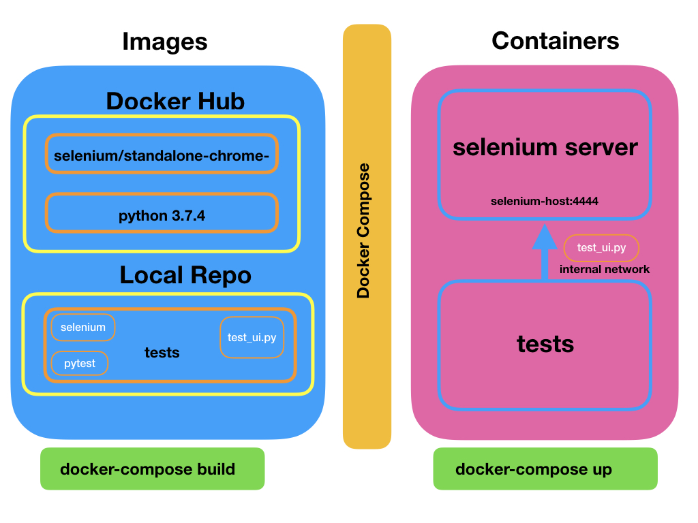

# Container Environment for Selenium Python Tests development

## Prepare IDE

1. Install `python3.7` for your machine: [Python Install](https://www.python.org/downloads/)

2. Get the instructions here: [Pycharm Community Install](https://www.jetbrains.com/help/pycharm/installation-guide.html#standalone)

3. Create a github account if you don't have one: [https://github.com/](https://github.com/)

4. Configure Pycharm:

## Selenium Local Setup

Setting up the test development environment may become a complicated task.
You can use the instructions below, but I recommend using the container solution in the next chapter.

- install one or more drivers on your machine so they can communicate with the web browsers
- add the paths of the drivers to your environment
- install selenium

Here are the details: [Selenium Install](https://selenium-python.readthedocs.io/installation.html)

These steps are different for every OS.

## Selenium Docker Setup

The scope of the dockerized arhitecture in test setup is to have the same environment for all.
The tests will be run on a remote selenium host represented by a container created from an official selenium image.

The selenium images can be found [here](https://hub.docker.com/u/selenium/)

Instructions on docker setup can be found [here](https://github.com/SeleniumHQ/docker-selenium)

The setup includes a host which has selenium and chrome installed.

The tests will reside in another container and will run remotely on the selenium host

## Services:

### Selenium
From official selenium image: selenium/standalone-chrome-debug:3.141.59-mercury

### Tests Integration
Where the tests reside. The tets can be written in the `/tests` folder.

## Start the setup
`docker-compose up --build`

This command builds the test image from local files, gets the selenium image that is already
configured and starts the containers.

## Access the Selenium Host

[Install VNC Viewer](https://www.realvnc.com/en/connect/download/viewer/)

Using VNC on `localhost:5901` and password `secret` because the selenium container has VNC installed.

## Run the tests after changes

    docker-compose exec test-integration bash
    root@8954656e2a32:/selenium-python_wks# pytest -s -v

To run a specific test use the pytest parameter `-k testname`

## Test Development

After the containers are started, if the volumes are set correctly, all the changes are instantly
available on the test container and can be run

